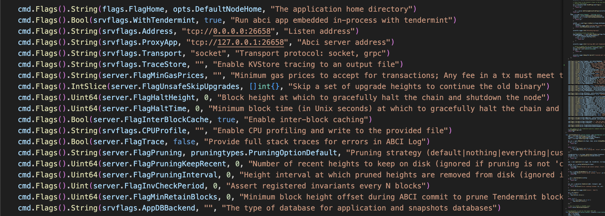
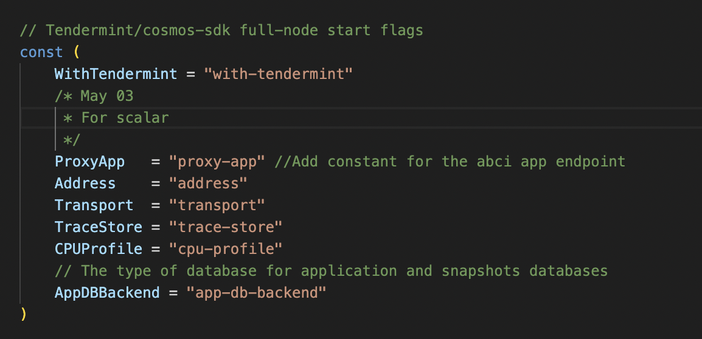

1. Modify Evmos code base

   Add flowing line into:

   `evmos/server/start.go`:
   

   `evmos/server/flags/flags.go`:
   

   ```
   // Tendermint/cosmos-sdk full-node start flags
   ```

2. Start dockers

   ```
   docker-compose -f docker-cluster-evmos.yaml up -d
   ```
